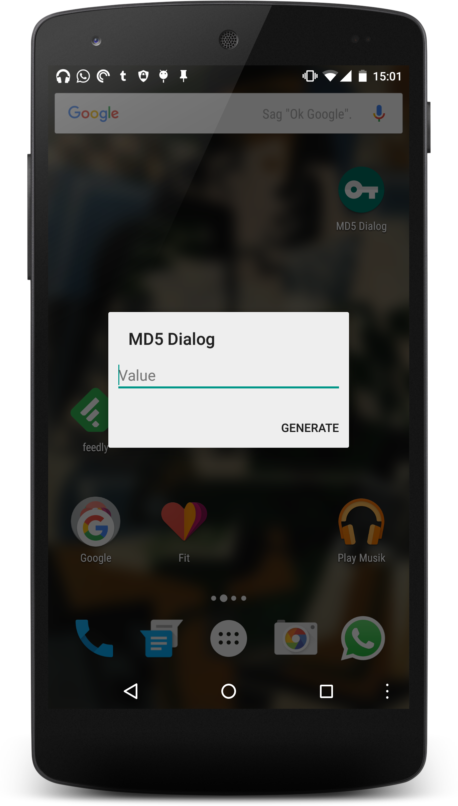

#  Md5 Dialog

Md5 Dialog is a minimal dialog-only application to get the [_message-digest algorithm v5_](https://en.wikipedia.org/wiki/MD5) (also known as MD5-) hash of a single string.

## Screenshots

&nbsp;

## Dependencies

- Release:
    - A android-device with Android 4.1 and up.
    - Android Support Annotations Library (licensed under Apache v2)
    
- Debug / Test:
    - Android Testing Support Library (licensed under Apache v2)

## Build

This project is developed using JetBrain's latest IntelliJ IDEA and the latest Gradle-wrapper.

To compile Md5 Dialog, simply import this project into **Android Studio** or **IntelliJ IDEA** and press the build-button.
**You may need to sign the built apk.** Read the official [documentation about signing applications](https://developer.android.com/tools/publishing/app-signing.html) for a how-to.

## License

Copyright (c) 2015 Lukas 'dotwee' Wolfsteiner
The source-code of MicroPinner is licensed under the [_Do What The Fuck You Want To_](/LICENSE) public license.